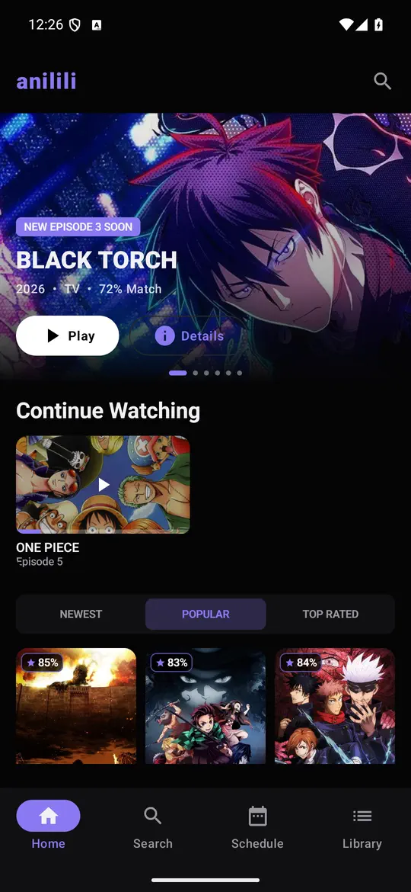
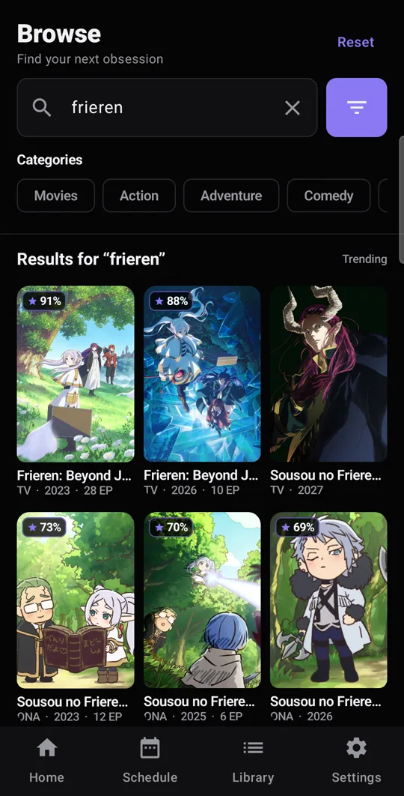
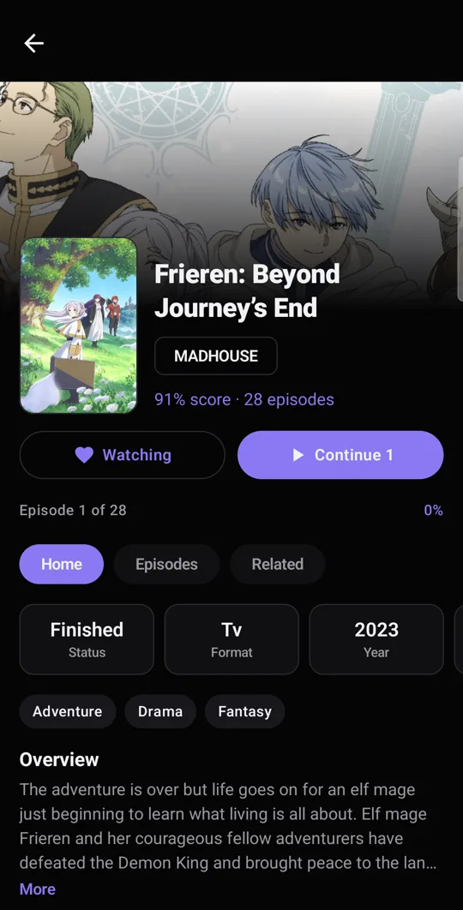
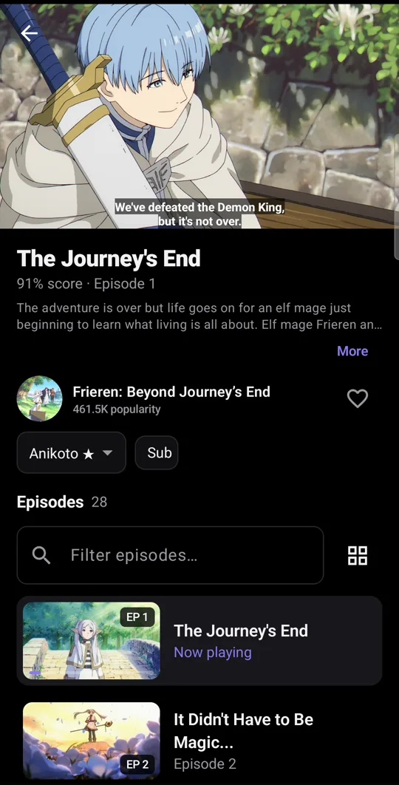
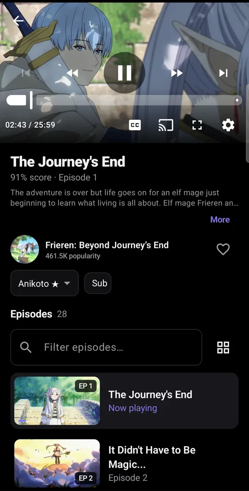
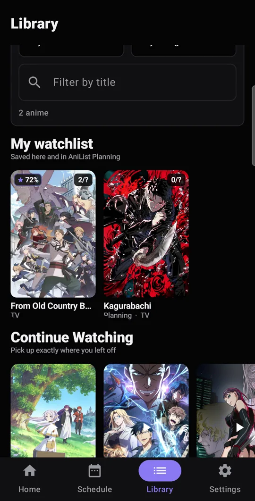

# Anilili

Anilili is a native Android anime streaming client built with Kotlin, Jetpack Compose, and
Media3. Metadata, login, library lists, and progress sync are powered by AniList or
MyAnimeList, while episodes and stream sources are resolved from multiple providers:
Miruro, AniKoto, ReAnime, AniZone, AnimeGG, AniNeko, and 2DHive.

It runs on phones, tablets, Android TV, and Fire TV down to Android 5.1 / Fire OS 5 (API 22).

<p align="center">
  <a href="https://kompoti121.github.io/Anilili/"><b>Website</b></a> ·
  <a href="https://github.com/kompoti121/Anilili/releases/latest"><b>Download APK</b></a> ·
  <a href="https://t.me/anililiapk"><b>Telegram</b></a>
</p>

Miruro streams are requested through the Miruro pipe endpoint and decoded on device.
Additional provider sources are resolved through the Anivexa-backed provider client. HLS
streams play with ExoPlayer; embed providers and fallback playback use WebView.

> Personal and educational project. This app is not affiliated with AniList, MyAnimeList,
> Miruro, AniKoto, ReAnime, AniZone, AnimeGG, AniNeko, or 2DHive. It hosts no content;
> streams are resolved from third-party providers at playback time. Sideloaded APK only.

## Screenshots

| Home | Search | Details |
| :---: | :---: | :---: |
| <a href="showcase/mobile/01-home.webp"></a> | <a href="showcase/mobile/03-search.webp"></a> | <a href="showcase/mobile/04-details.webp"></a> |

| Watch | Player controls | Library |
| :---: | :---: | :---: |
| <a href="showcase/mobile/05-watch.webp"></a> | <a href="showcase/mobile/06-player-controls.webp"></a> | <a href="showcase/mobile/07-library.webp"></a> |

## Features

- Home feeds for trending, popular, and recently released anime.
- Browse and search with genre, tag, year, status, format, rating, and sort filters.
- Anime details, provider selection, sub/dub selection, ratings, and episode lists.
- Multi-provider stream discovery across Miruro, AniKoto, ReAnime, AniZone, AnimeGG,
  AniNeko, and 2DHive.
- Native HLS playback with subtitles, skip intro, and auto advance.
- WebView playback for embed providers and fallback player routes.
- AniList or MyAnimeList login with watching, planning, paused, and completed list views.
- Watch history, continue-watching resume positions, local watchlist, and optional
  AniList/MyAnimeList episode progress sync.
- Adaptive Compose UI for phone and TV-style layouts.

## Project Structure

| Path | Purpose |
| --- | --- |
| `app/src/main/java/com/miruronative/data` | Domain models and provider catalog |
| `app/src/main/java/com/miruronative/data/remote` | AniList, Miruro pipe, and provider clients |
| `app/src/main/java/com/miruronative/ui` | Compose screens and player UI |
| `docs/PIPE_PROTOCOL.md` | Notes about the Miruro pipe format |
| `showcase/mobile` | Six optimized 540×1062 WebP screenshots |
| `docs/` | GitHub Pages landing page (https://kompoti121.github.io/Anilili/) |

## Build

Requirements:

- JDK 17
- Android Studio or Android SDK API 35
- Gradle 8.13 if building from the command line without a generated wrapper

Android Studio:

1. Open this repository folder.
2. Let Gradle sync.
3. Run the app on a device/emulator or use Build > Build APK(s).

Command line:

```bash
gradle wrapper
./gradlew assembleDebug
```

On Windows, use:

```powershell
gradlew.bat assembleDebug
```

Debug builds generate three APKs in `app/build/outputs/apk/debug/`: `Anilili-debug.apk`
(universal), `Anilili-debug_arm64-v8a.apk`, and `Anilili-debug_armeabi-v7a.apk`.
Release builds use the same three-way layout without the `-debug` suffix. All three support
Android/Fire OS API 22 and up.

Release assets must keep these names: the in-app updater picks the ABI split by matching
`arm64-v8a` / `armeabi-v7a` in the asset name and falls back to the universal `Anilili.apk`.
Matching is case-insensitive, so lowercase assets from releases before v0.1.34 still resolve.

The ABI splits use `_` (not `-`) before the ABI on purpose: updaters in v0.1.32 and earlier
install the release's *first* `.apk` asset, and GitHub sorts assets by name. `.` sorts before
`_`, so the universal `Anilili.apk` stays first and legacy devices always get an APK that runs
on their hardware. With `-` names, a 32-bit Fire TV on an old version would download the
arm64 split and hit "app not compatible with this device".

## Notes

- `local.properties`, build output, IDE files, Graphify output, temporary folders, and old API
  bundles are intentionally ignored.
- The showcase folder is intentionally limited to the six mobile screenshots shown above.
